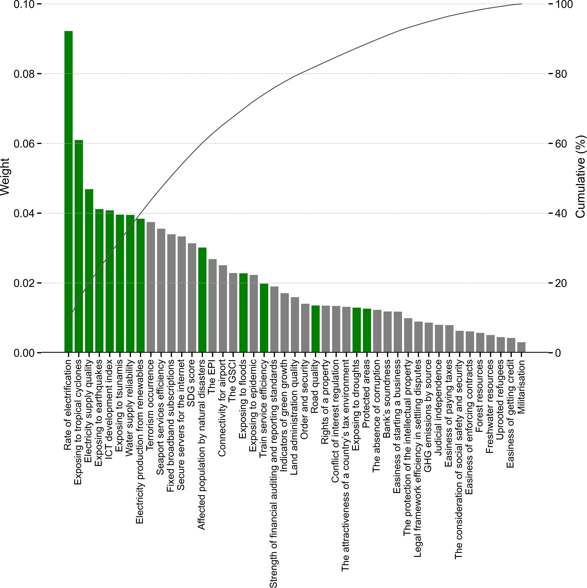
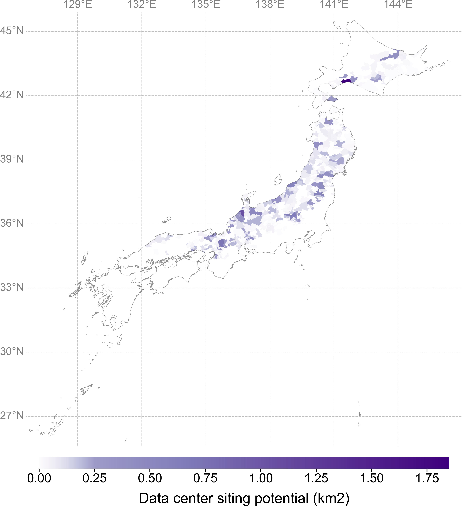

# Integrated Location Assessment (ILA)

The Integrated Location Assessment (ILA) framework estimates the siting potential of each region using the following equation:

$$
Siting Potential = Regional Suitability × (Land Area − Exclusion Area)
$$

The (Land Area − Exclusion Area) component is derived through pre-processing using GIS tools. It represents the land that is physically and legally available for siting after applying exclusion criteria (e.g., local hazard risks).

Regional Suitability typically refers to binary parameters that determine whether the available land is suitable for development based on regional characteristics (e.g., widespread hazard risks).

This repository provides a Python-based implementation of the second stage of the ILA pipeline. It takes the GIS-derived available area data and combines it with region-specific factors to compute the final siting potential and visualize the results on a map.

This code can be easily executed in VS Code, Google Colab, or any Jupyter notebook environment.

 

## Demonstration for Data Centers in Japan
### Assessment Criteria

Note:
Green bars indicate the regional criteria incorporated into our ILA. Gray bars represent criteria typically assessed at the national level or lacking available regional-level data.

Data source:
Erdem and Özdemir; Sustainability and risk assessment of data center locations under a fuzzy environment. Journal of Cearner Production (2024)
[https://doi.org/10.1016/j.jclepro.2024.141982](https://doi.org/10.1016/j.jclepro.2024.141982)

### Caluculated Data Center Siting Potential

